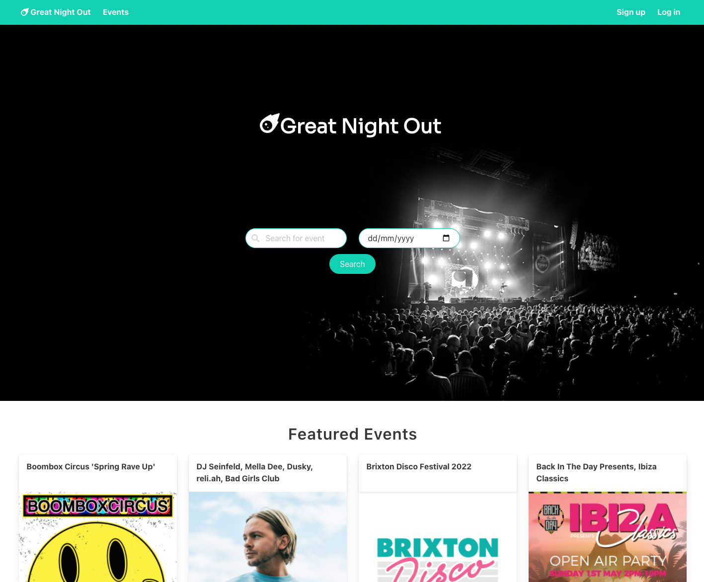
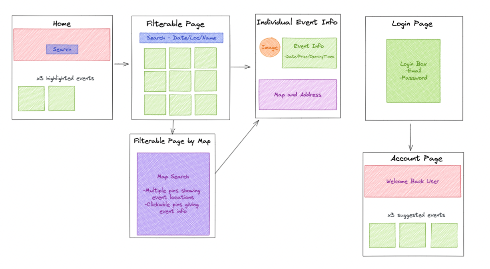

# Great Night Out - GA Project 2



## Overview
Great Night Out is an events app built using React during a two-day hackathon as part of the General Assembly course. The app uses two public APIs (Skiddle events and Mapbox). 

> Pair-coded with [Edward Foulds](https://github.com/FouldsEJ)\
> Duration: 48 hours\
> Technologies: HTML, SCSS/Bulma, JavaScript, React, Axios, Postman

The app is deployed on Netlify and available here &rarr; https://greatnightout.netlify.app/ \
[](https://app.netlify.com/sites/greatnightout/deploys)

## The Brief
Build a React application that consumes a public API. The app must include a router, have several components and be deployed online. 

## Approach
### Skiddle API
After successfully testing some endpoints in Postman, we decided to build an events site using the Skiddle API (https://github.com/Skiddle/web-api). 

We used the events search endpoint https://www.skiddle.com/api/v1/events/search/ to GET multiple events using the following URL parameters:
- Search by keyword: **keyword** (string)
- Get events on or after a date: **minDate** (YYYY-MM-DD)
- Filter by event type: **eventcode** (string)
- Get Skiddle recommended events: **specialFeatured** (bool)
- Limit the number of results: **limit** (int)

We also used the event details endpoint https://www.skiddle.com/api/v1/events/12345/ to GET information for a single event. 

### Planning
Our MVP was to fetch data from the API, display it on the frontend and implement some searching or filtering functionality. Having noticed that the data returned from the event details endpoint included longitude and latitude for the event venue, we also discussed a stretch goal of integrating maps. Here is our wireframe: 



### Functionality
I focussed on the EventsIndex component and implemented the search and filter functionality. This involved using multiple search parameters and a couple of different API calls depending on whether the user had selected an eventcode. 

The API does not have an eventcode for ‘ALL’, therefore I used an _if statement_ to check if the user had selected ‘ALL’ from the dropdown (value set to an empty string), to determine which endpoint to use. When implementing the date filter, I added today’s date as a default minDate as the API did not allow you to send through a blank value.

```javascript
const getData = async () => {
  try {
    if (formData.eventcode === '') {
      const {
        data: { results },
      } = await getAllEvents({ ...formData });
      setEvents(results);
    } else {
      const {
        data: { results },
      } = await getAllEventsWithEventCode({ ...formData });
      setEvents(results);
    }
  } catch (err) {
    console.error(err);
  }
};
  ```
  
I added a ‘Load more events’ button which increased the number of results returned up to the API’s limit of 100. Once 100 results have been returned, the button is no longer displayed. 

We also wanted to have user input on the home page which would be passed through to the events index page and display filtered results. This was achieved by passing the input values from the Home component to the EventsIndex component and using the values to set the initial state.  

To do this, when the user clicks ‘Search’ on the home page, the _useNavigate_ hook navigates to the events page, with the state object as the second argument. Then on the events page, the _useLocation_ hook accesses the state property on the location object and uses this to set the filter values. 

Home.js:
```javascript
function handleSearchChange(e) {
  setUserSearch({ ...userSearch, [e.target.name]: e.target.value });
}

function handleSubmit(e) {
  e.preventDefault();
  console.log('userSearch: ', userSearch);
  navigate('/events', { state: userSearch });
}
```

EventsIndex.js:
```javascript
const EventsIndex = () => {
  const [events, setEvents] = React.useState(null);
  const location = useLocation();
  const [formData, setFormData] = React.useState({
    keyword: location.state?.event || '',
    minDate: location.state?.date || today,
    eventcode: '',
    limit: 20,
  });
```

### Styling
We used the Bulma CSS framework for styling as it enabled us to quickly create a clean and responsive website. 

## Bugs 
On the events index page, the ‘Load more events’ button still appears even if there are less than 20 results returned from a search. 

We also encountered an issue during deployment where the map appears as a grey box. It is a known bug with using Mapbox with Netlify and we have not found a workaround yet.

## Wins and Wishes
This was my first pair-coded project and it was a positive experience collaborating with Ed. We set ourselves ambitious stretch goals, which with good teamwork we were able to achieve within a short time frame.

I would like to improve the ‘Load more events’ button to use _offset_ in conjunction with _limit_ to allow users to load more than 100 events and add an additional feature to have a map view on the events index page. 

## Key Learnings
This was my first experience building a React app and I learned about _state_, _useEffect_ and passing _props_ between components. Furthermore, this provided practice working together on a single repo using Git branching. 

